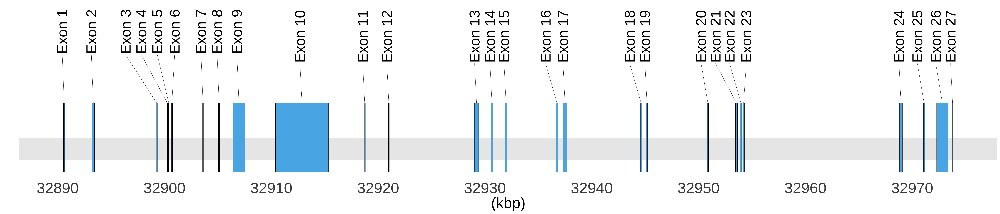

# Introduction

BRCA2 is a human tumor suppressor gene (specifically, a caretaker gene), found in all humans; its protein, also called by the synonym breast cancer type 2 susceptibility protein, is responsible for repairing DNA. Inherited mutations in BRCA1 and this gene, BRCA2, confer an increased lifetime risk of developing breast or ovarian cancer. Both BRCA1 and BRCA2 are involved in the maintenance of genome stability, specifically the homologous recombination pathway for double-strand DNA repair. The largest exon in both genes is exon 11, which harbors the most important and frequent mutations in breast cancer patients. The BRCA2 gene was found on chromosome 13q12.3 in humans. The BRCA2 protein contains several copies of a 70 aa motif called the BRC motif, and these motifs mediate binding to the RAD51 recombinase which functions in DNA repair. BRCA2 is considered a tumor suppressor gene, as tumors with BRCA2 mutations generally exhibit loss of heterozygosity (LOH) of the wild-type allele. \textbf{This brief study will attempt to investigate large deletion and the exon skipping in BRCA2 splicing in different types of cancer}. 

```{r global-options, include=FALSE}
knitr::opts_chunk$set(
  fig.pos = 'H',
  fig.path="figs/",
  # specify the path for saving the figs 
  cache       = TRUE,
  # if TRUE knitr will cache the results to reuse in future knits
  fig.align   = 'center',
  # how to align graphics in the final doc. 'left', 'right', 'center'
  results     = 'asis',
  # # knitr will pass through results without reformatting them
  echo        = TRUE,
  # in FALSE knitr will not display code in the code chunk above it's results
  message     = TRUE,
  # if FALSE knitr will not display any messages generated by code
  strip.white = TRUE,
  # if FALSE knitr will not remove white spaces at the beg or end of code chunk
  warning     = FALSE,
  todor_rmd = TRUE
)    # if FALSE knitr will not display any warning messages in the final document
```


```{r cars, include=FALSE}

# install and load  three package  managers
mang_pkgs = c("BiocManager", "pacman", "easypackages")
 if (!requireNamespace(mang_pkgs, quietly = TRUE))
    install.packages(mang_pkgs)

# install and load bioconductor packages 
bio_pkgs = c("BiocManager", "ggbio", "biomaRt", "EnsDb.Hsapiens.v75", "cBioPortalData", "GenomicRanges", "GenomicFeatures", "TxDb.Hsapiens.UCSC.hg19.knownGene", "Homo.sapiens")

invisible(lapply(pkgs, function(x) library(x, character.only=TRUE)))

BiocManager::install(bio_pkgs)

# install and load CRAN packages
if (!require("pacman")) install.packages("pacman")
pacman::p_load(renv, tidygraph, easypackages, tidyverse, data.table, ggforce, ggrepel, knitr, ggforce, showtext, todor, here)

#Change fonts
font_add_google(name='Nunito')
showtext_auto()
```

```{r renv, message=FALSE, warning=FALSE, include=FALSE}

#initiate an environment for libs
#renv::init()

```


# Retrive the exons of BRCA2

Initially, we need to retrieve the unmber of exons for BRCA2 and their positions based on the genome reference consortium human genome build 37 (GRCh37).  We will use `BioMart` from `Bioconductor package` in `R` to map the start and the end position of each exon. The `BioMart` package enables retrieval of large amounts of data in a uniform way.


```{r transcripts, echo=FALSE, message=FALSE, warning=FALSE, fig.showtext=TRUE}
# FIXME refator all the code, remove repetitions, add function, make a package   
  ensdb <- EnsDb.Hsapiens.v75
  ggbio::autoplot(
    ensdb,
    GeneNameFilter("BRCA2"),
    fill = "#56B4E9",
    color = "black",
    size = 0.1,
    gap.geom = "segment"
  ) +
  theme_bw() +
  theme(
    panel.grid.major.y = element_blank(),
    panel.grid.minor.y = element_blank(),
    panel.grid.major.x = element_blank(),
    panel.grid.minor.x = element_blank(),
    panel.border = element_blank()
  )
```


```{r echo=FALSE}
# TODO create function to import the data of exons for any genes 
# 1- choosing the mart
ensembl <-
  useMart(
    biomart = "ENSEMBL_MART_ENSEMBL",
    host = "grch37.ensembl.org",
    path = "/biomart/martservice",
    dataset = "hsapiens_gene_ensembl"
  )
# 2- Retrieve the exons using Refseq: NM_000059
exon <-
  getBM(
    attributes = c(
      'chromosome_name',
      'exon_chrom_start',
      'exon_chrom_end',
      '5_utr_start',
      '5_utr_end',
      '3_utr_start',
      '3_utr_end'
    ),
    filters = "refseq_mrna",
    values = "NM_000059",
    bmHeader = TRUE,
    mart = ensembl
  )
# 3- Cleaning up the data
exon <- exon %>%
  rename_all(
    .funs = function(.x) {
      .x %>% tolower() %>% str_replace_all(pattern = " |\\)|\\(", replacement = "_")
    }
  ) %>%
  subset(exon_region_start__bp_ != 32889617)
rownames(exon) <- seq(1, nrow(exon))
exon <- exon %>%
  mutate(exon_length = exon_region_end__bp_ - exon_region_start__bp_) %>%
  mutate(exon_rank = seq(1, nrow(exon))) %>%
  as.data.frame()

```


```{r drawing_exons, echo=FALSE, message=FALSE, warning=FALSE}
# TODO create a function for drawing exons of any gene
# TODO change the foramte of the fig
# drawing of the exons in BRCA2
d = data.frame(
  x1 = (exon$exon_region_start__bp_)/1000,
  x2 = (exon$exon_region_end__bp_)/1000,
  # y1 = c(1.5, 1.5),
  # y2 = c(2, 2),
  t = paste0('Exon ' , seq(1, nrow(exon))),
  labels = paste0('Exon ' , seq(1, nrow(exon)))
)
y_limits <- c(2.1, Inf)
plot <- ggplot() +
  scale_x_continuous(name = "(kbp)", scales::pretty_breaks(n = 8)) +
  scale_y_continuous(name = "") +
  geom_hline(yintercept = 1.6, size=20, alpha = 0.1) +
  geom_rect(
    data = d,
    mapping = aes(
      xmin = x1,
      xmax = x2,
      ymin = 1.5,
      ymax = 1.8,
      # color = "#000099",
      # fill = "#000099",
      label = labels
    ),
    color = "black",
    fill = "#56B4E9"
  ) +
   geom_text_repel(
    data = d,
    aes(
      x = x1 + (x2 - x1) / 2,
      y = 1.8,
      label = labels,
      ),
    size = 10,
    # force_pull   = 10, # do not pull toward data points
    nudge_y      = 5,
    direction    = "x",
    angle        = 90,
    vjust        = 0.4,
    segment.size = 0.2,
    ) +
  ylim(1.5, 2.2) +
  xlab("(kbp)") +
  ylab("") +
  theme_minimal() +
  theme(legend.position = "none",
        panel.grid.major.y = element_blank(),
        panel.grid.minor.y = element_blank(),
        panel.grid.major.x = element_blank(),
        panel.grid.minor.x = element_blank(),
        axis.text.y = element_blank(),
        axis.text.x = element_text(size = 30),
        axis.ticks.length = unit(3, "pt"),
        text = element_text(size = 30))

ggsave("exons.jpg", width = 70, height = 15, units = "cm")

```

```{r fig1, echo=FALSE, fig.showtext=TRUE, fig.cap="\\label{fig:fig1}Mapping of the exons and introns in BRCA2 gene"}

```


```{r clean-exons_df, echo=FALSE, results='asis'}
# 4- furtherclaening and presenting of the data
cleaned_exon <- exon %>%
  dplyr::select(c(
    exon_region_start__bp_,
    exon_region_end__bp_,
    exon_rank,
    exon_length
  )) %>%
  dplyr::rename(
    'Start (bp)' = exon_region_start__bp_,
    'End (bp)' = exon_region_end__bp_, 
    Exon = exon_rank,
    'Region Length' = exon_length
  )
cleaned_exon <- cleaned_exon[, c(3, 1, 2, 4)]
cleaned_exon %>%
  knitr::kable(caption = "The positions of the exons boundaries of BRCA2 in chromosome 13.")
```

\newpage

# Integrate RNA-seq data from cBioPortal

We integrated 240 studies from cBioPortal. The studies spans 91 cancer types which contain in total 116930 samples. The study with the most samples is Cancer Therapy and Clonal Hematopoiesis (MSK, Nat Genet 2020). In order to explore the top 20 studies according to the number of samples.

```{r all-cbioportal, include=FALSE}
cbio <- cBioPortal()
studies <- getStudies(cbio)
dim(studies)
unique(studies$cancerTypeId)
cat("Answer 1: There are", nrow(studies), "studies in cBioPortal")
cat("Answer 2: The studies spans", length(unique(studies$cancerTypeId)), "cancer types")
cat("Answer 3: There are ",
    sum(studies$allSampleCount),
    "samples in cBioPortal")
cat("Answer 4: The study with the most samples is", studies[which.max(studies$allSampleCount), "name"][[1]])
```


```{r plot-all-studies, message=FALSE, fig.showtext=TRUE, warning=FALSE, include=FALSE}
studies %>%
  dplyr::filter(cancerTypeId != "mixed") %>%     # add filter for mixed type
  dplyr::group_by(cancerTypeId) %>%
  dplyr::summarise(totalSamples = sum(allSampleCount)) %>%
  dplyr::arrange(desc(totalSamples)) %>%
  top_n(20) %>%
  mutate(cancerTypeId = toupper(cancerTypeId)) %>%
  mutate(cancerTypeId = fct_reorder(cancerTypeId, totalSamples, .desc = FALSE))  %>%
  ggplot2::ggplot(aes(x = cancerTypeId, y = totalSamples)) +
  geom_col(aes(fill = ifelse(totalSamples > 4000, "red", "#56B4E9")), color = "black", size = 0.2) + 
  scale_fill_identity() +
  xlab(label = 'Cancer Type') +
  ylab('Total Samples') +
  ylim(0, 8000) +
  scale_y_continuous(expand = expansion(mult = c(0, .1))) +
  coord_flip() +
  theme_bw() +
  theme(
    panel.grid = element_blank(),
    panel.border = element_blank(),
    text = element_text(color = "grey20"),
    axis.text.x = element_text (size = 8),
    axis.text.y = element_text(),
    legend.title = element_blank(),
    legend.position = "none"
  )
ggsave(here("docs/figs","cbioportal.jpg"))
```

```{r fig2, out.width="100%", echo=FALSE, fig.showtext=TRUE, fig.cap="\\label{fig:fig2}The top 20 studies in cBioPortal according to the number of samplse"}
knitr::include_graphics(here("docs/figs","cbioportal.jpg"))
```


```{r clean-BRCA2-mutations, include=FALSE}
df = as.data.frame(fread(here("data","alterations.tsv")))

df <- df %>%
  rename_all(
    .funs = function(.x) {
      .x %>% tolower() %>% str_replace_all(pattern = ",| ", replacement = "_")
    }
  ) %>%
  separate(study, into = c("study", "ref"), sep = "\\s(?=\\()") %>%
  separate(
    annotation,
    into = c(
      "OncoKB",
      "CIViC",
      "MyCancerGenome",
      "CancerHotspot",
      "3DHotspot",
      "MutationAssessor",
      "SIFT",
      "Polyphen"
    ),
    sep = ";"
  ) %>%
  separate(
    functional_impact,
    into = c("MutationAssessor",
             "SIFT",
             "Polyphen"),
    sep = ";"
  ) %>%
  mutate(across(OncoKB:'3DHotspot',  ~ str_remove_all(., pattern = "\\w+:"))) %>%
  mutate(across(
    MutationAssessor:Polyphen,
    ~ str_remove_all(., pattern = "\\w+:")
  )) %>%
  mutate(OncoKB = str_replace_all(OncoKB, pattern = "_", replacement = " ")) %>% 
  dplyr::select(-sample_id, -cancer_type, -`copy_#`) %>% 
  mutate(exon = str_remove_all(exon, pattern = "/\\d+"))
df3 <- df %>%
  dplyr::select(study, ref, mutation_type, exon) %>%
  group_by(ref) %>%
  summarise(
    Frame_Shift_Del = sum(mutation_type == 'Frame_Shift_Del'),
    Frame_Shift_Ins = sum(mutation_type == 'Frame_Shift_Ins'),
    Nonsense_Mutation = sum(mutation_type == 'Nonsense_Mutation'),
    Missense_Mutation = sum(mutation_type == 'Missense_Mutation'),
    Splice_Site = sum(mutation_type == 'Splice_Site'),
    Splice_Region = sum(mutation_type == 'Splice_Region'),
    Fusion = sum(mutation_type == 'Fusion'),
    In_Frame_Del = sum(mutation_type == 'In_Frame_Del'),
    In_Frame_Ins = sum(mutation_type == 'In_Frame_Ins')
  ) %>%
  data_frame()
`
```
