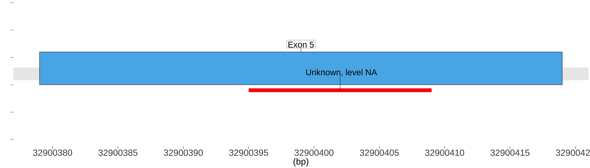
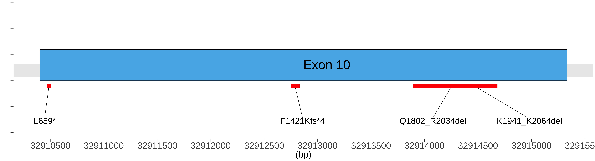

# Introduction

BRCA2 is a human tumor suppressor gene (specifically, a caretaker gene), found in all humans; its protein, also called by the synonym breast cancer type 2 susceptibility protein, is responsible for repairing DNA. Inherited mutations in BRCA1 and this gene, BRCA2, confer an increased lifetime risk of developing breast or ovarian cancer. Both BRCA1 and BRCA2 are involved in the maintenance of genome stability, specifically the homologous recombination pathway for double-strand DNA repair. The largest exon in both genes is exon 11, which harbors the most important and frequent mutations in breast cancer patients. The BRCA2 gene was found on chromosome 13q12.3 in humans. The BRCA2 protein contains several copies of a 70 aa motif called the BRC motif, and these motifs mediate binding to the RAD51 recombinase which functions in DNA repair. BRCA2 is considered a tumor suppressor gene, as tumors with BRCA2 mutations generally exhibit loss of heterozygosity (LOH) of the wild-type allele. \textbf{This brief study will attempt to investigate large deletion and the exon skipping in BRCA2 splicing in different types of cancer}. 

```{r global-options, include=FALSE}
knitr::opts_chunk$set(
  fig.pos = 'H',
  fig.path="figs/",
  # specify the path for saving the figs 
  cache       = TRUE,
  # if TRUE knitr will cache the results to reuse in future knits
  fig.align   = 'center',
  # how to align graphics in the final doc. 'left', 'right', 'center'
  results     = 'asis',
  # # knitr will pass through results without reformatting them
  echo        = TRUE,
  # in FALSE knitr will not display code in the code chunk above it's results
  message     = TRUE,
  # if FALSE knitr will not display any messages generated by code
  strip.white = TRUE,
  # if FALSE knitr will not remove white spaces at the beg or end of code chunk
  warning     = FALSE,
  todor_rmd = TRUE
)    # if FALSE knitr will not display any warning messages in the final document
```


```{r lib-install, include=FALSE}

# install and load  three package  managers
mang_pkgs = c("BiocManager", "pacman", "easypackages")
 if (!requireNamespace(mang_pkgs, quietly = TRUE))
    install.packages(mang_pkgs)

# install and load bioconductor packages 
bio_pkgs = c("BiocManager", "ggbio", "biomaRt", "EnsDb.Hsapiens.v75", "cBioPortalData", "GenomicRanges", "GenomicFeatures", "TxDb.Hsapiens.UCSC.hg19.knownGene", "Homo.sapiens")

# invisible(lapply(pkgs, function(x) library(x, character.only=TRUE)))

BiocManager::install(bio_pkgs)

# install and load CRAN packages
if (!require("pacman")) install.packages("pacman")
pacman::p_load(renv, tidygraph, easypackages, tidyverse, data.table, ggforce, ggrepel, knitr, ggforce, showtext, todor, here)

#Change fonts
font_add_google(name='Nunito')
showtext_auto()
```

```{r renv, message=FALSE, warning=FALSE, include=FALSE}

#initiate an environment for libs
#renv::init()

```

```{r libs}
library(EnsDb.Hsapiens.v75)
library(biomaRt)
library(cBioPortalData)
```


# Retrive the exons of BRCA2

Initially, we need to retrieve the unmber of exons for BRCA2 and their positions based on the genome reference consortium human genome build 37 (GRCh37).  We will use `BioMart` from `Bioconductor package` in `R` to map the start and the end position of each exon. The `BioMart` package enables retrieval of large amounts of data in a uniform way.


```{r transcripts, echo=FALSE, message=FALSE, warning=FALSE, fig.showtext=TRUE}
# FIXME refator all the code, remove repetitions, add function, make a package   
  ensdb <- EnsDb.Hsapiens.v75
  ggbio::autoplot(
    ensdb,
    GeneNameFilter("BRCA2"),
    fill = "#56B4E9",
    color = "black",
    size = 0.1,
    gap.geom = "segment"
  ) +
  theme_bw() +
  theme(
    panel.grid.major.y = element_blank(),
    panel.grid.minor.y = element_blank(),
    panel.grid.major.x = element_blank(),
    panel.grid.minor.x = element_blank(),
    panel.border = element_blank()
  )
```


```{r echo=FALSE}
# TODO create function to import the data of exons for any genes 
# 1- choosing the mart
ensembl <-
  useMart(
    biomart = "ENSEMBL_MART_ENSEMBL",
    host = "grch37.ensembl.org",
    path = "/biomart/martservice",
    dataset = "hsapiens_gene_ensembl"
  )
# 2- Retrieve the exons using Refseq: NM_000059
exon <-
  getBM(
    attributes = c(
      'chromosome_name',
      'exon_chrom_start',
      'exon_chrom_end',
      '5_utr_start',
      '5_utr_end',
      '3_utr_start',
      '3_utr_end'
    ),
    filters = "refseq_mrna",
    values = "NM_000059",
    bmHeader = TRUE,
    mart = ensembl
  )
# 3- Cleaning up the data
exon <- exon %>%
  rename_all(
    .funs = function(.x) {
      .x %>% tolower() %>% str_replace_all(pattern = " |\\)|\\(", replacement = "_")
    }
  ) %>%
  subset(exon_region_start__bp_ != 32889617)
rownames(exon) <- seq(1, nrow(exon))
exon <- exon %>%
  mutate(exon_length = exon_region_end__bp_ - exon_region_start__bp_) %>%
  mutate(exon_rank = seq(1, nrow(exon))) %>%
  as.data.frame()

```


```{r drawing_exons, echo=FALSE, message=FALSE, warning=FALSE}
# TODO create a function for drawing exons of any gene
# TODO change the foramte of the fig
# drawing of the exons in BRCA2
d = data.frame(
  x1 = (exon$exon_region_start__bp_)/1000,
  x2 = (exon$exon_region_end__bp_)/1000,
  # y1 = c(1.5, 1.5),
  # y2 = c(2, 2),
  t = paste0('Exon ' , seq(1, nrow(exon))),
  labels = paste0('Exon ' , seq(1, nrow(exon)))
)
y_limits <- c(2.1, Inf)
plot <- ggplot() +
  scale_x_continuous(name = "(kbp)", scales::pretty_breaks(n = 8)) +
  scale_y_continuous(name = "") +
  geom_hline(yintercept = 1.6, size=20, alpha = 0.1) +
  geom_rect(
    data = d,
    mapping = aes(
      xmin = x1,
      xmax = x2,
      ymin = 1.5,
      ymax = 1.8,
      # color = "#000099",
      # fill = "#000099",
      label = labels
    ),
    color = "black",
    fill = "#56B4E9"
  ) +
   geom_text_repel(
    data = d,
    aes(
      x = x1 + (x2 - x1) / 2,
      y = 1.8,
      label = labels,
      ),
    size = 10,
    # force_pull   = 10, # do not pull toward data points
    nudge_y      = 5,
    direction    = "x",
    angle        = 90,
    vjust        = 0.4,
    segment.size = 0.2,
    ) +
  ylim(1.5, 2.2) +
  xlab("(kbp)") +
  ylab("") +
  theme_minimal() +
  theme(legend.position = "none",
        panel.grid.major.y = element_blank(),
        panel.grid.minor.y = element_blank(),
        panel.grid.major.x = element_blank(),
        panel.grid.minor.x = element_blank(),
        axis.text.y = element_blank(),
        axis.text.x = element_text(size = 30),
        axis.ticks.length = unit(3, "pt"),
        text = element_text(size = 30))

ggsave("exons.jpg", width = 70, height = 15, units = "cm")

```

## Exons in BRCA2 gene

```{r fig1, echo=FALSE, fig.showtext=TRUE, fig.cap="\\label{fig:fig1}Mapping of the exons and introns in BRCA2 gene"}

```


```{r clean-exons_df, echo=FALSE, results='asis'}
# 4- further claening and presenting of the data
cleaned_exon <- exon %>%
  dplyr::select(c(
    exon_region_start__bp_,
    exon_region_end__bp_,
    exon_rank,
    exon_length
  )) %>%
  dplyr::rename(
    'Start (bp)' = exon_region_start__bp_,
    'End (bp)' = exon_region_end__bp_, 
    Exon = exon_rank,
    'Region Length' = exon_length
  )
cleaned_exon <- cleaned_exon[, c(3, 1, 2, 4)]
cleaned_exon %>%
  knitr::kable(caption = "The positions of the exons boundaries of BRCA2 in chromosome 13.")
```

\newpage

# Integrate RNA-seq data from cBioPortal

We integrated 240 studies from cBioPortal. The studies spans 91 cancer types which contain in total 116930 samples. The study with the most samples is Cancer Therapy and Clonal Hematopoiesis (MSK, Nat Genet 2020). In order to explore the top 20 studies according to the number of samples.

```{r all-cbioportal, include=FALSE}
cbio <- cBioPortal()
studies <- getStudies(cbio)
dim(studies)
unique(studies$cancerTypeId)
cat("Answer 1: There are", nrow(studies), "studies in cBioPortal")
cat("Answer 2: The studies spans", length(unique(studies$cancerTypeId)), "cancer types")
cat("Answer 3: There are ",
    sum(studies$allSampleCount),
    "samples in cBioPortal")
cat("Answer 4: The study with the most samples is", studies[which.max(studies$allSampleCount), "name"][[1]])
```


```{r plot-all-studies, message=FALSE, fig.showtext=TRUE, warning=FALSE, include=FALSE}
studies %>%
  dplyr::filter(cancerTypeId != "mixed") %>%     # add filter for mixed type
  dplyr::group_by(cancerTypeId) %>%
  dplyr::summarise(totalSamples = sum(allSampleCount)) %>%
  dplyr::arrange(desc(totalSamples)) %>%
  top_n(20) %>%
  mutate(cancerTypeId = toupper(cancerTypeId)) %>%
  mutate(cancerTypeId = fct_reorder(cancerTypeId, totalSamples, .desc = FALSE))  %>%
  ggplot2::ggplot(aes(x = cancerTypeId, y = totalSamples)) +
  geom_col(aes(fill = ifelse(totalSamples > 4000, "red", "#56B4E9")), color = "black", size = 0.2) + 
  scale_fill_identity() +
  xlab(label = 'Cancer Type') +
  ylab('Total Samples') +
  ylim(0, 8000) +
  scale_y_continuous(expand = expansion(mult = c(0, .1))) +
  coord_flip() +
  theme_bw() +
  theme(
    panel.grid = element_blank(),
    panel.border = element_blank(),
    text = element_text(color = "grey20"),
    axis.text.x = element_text (size = 8),
    axis.text.y = element_text(),
    legend.title = element_blank(),
    legend.position = "none"
  )
ggsave(here("figs","cbioportal.jpg"))
```

## Summary of all the Studies 

```{r fig2, out.width="100%", echo=FALSE, fig.showtext=TRUE, fig.cap="\\label{fig:fig2}The top 20 studies in cBioPortal according to the number of samplse"}
knitr::include_graphics(here("figs","cbioportal.jpg"))

```
```{r}
# BRCA: BReast CAncer
# MDS: Myelodysplastic syndromes
# PRAD	Prostate adenocarcinoma
# COAD	Colon adenocarcinoma
# READ	Rectum adenocarcinoma
# LUAD	Lung adenocarcinoma
# LAML	Acute Myeloid Leukemia
# ACC	Adrenocortical carcinoma
# BLCA	Bladder Urothelial Carcinoma
# LGG	Brain Lower Grade Glioma
# BRCA	Breast invasive carcinoma
# CESC	Cervical squamous cell carcinoma and endocervical adenocarcinoma
# CHOL	Cholangiocarcinoma
# LCML	Chronic Myelogenous Leukemia
# COAD	Colon adenocarcinoma
# CNTL	Controls
# ESCA	Esophageal carcinoma
# FPPP	FFPE Pilot Phase II
# GBM	Glioblastoma multiforme
# HNSC	Head and Neck squamous cell carcinoma
# KICH	Kidney Chromophobe
# KIRC	Kidney renal clear cell carcinoma
# KIRP	Kidney renal papillary cell carcinoma
# LIHC	Liver hepatocellular carcinoma
# LUSC	Lung squamous cell carcinoma
# DLBC	Lymphoid Neoplasm Diffuse Large B-cell Lymphoma
# MESO	Mesothelioma
# MISC	Miscellaneous
# OV	Ovarian serous cystadenocarcinoma
# PAAD	Pancreatic adenocarcinoma
# PCPG	Pheochromocytoma and Paraganglioma
# SARC	Sarcoma
# SKCM	Skin Cutaneous Melanoma
# STAD	Stomach adenocarcinoma
# TGCT	Testicular Germ Cell Tumors
# THYM	Thymoma
# THCA	Thyroid carcinoma
# UCS	Uterine Carcinosarcoma
# UCEC	Uterine Corpus Endometrial Carcinoma
# UVM	Uveal Melanoma
```


```{r clean-BRCA2-mutations, include=FALSE}
df = as.data.frame(fread(here("data","alterations.tsv")))

df <- df %>%
  rename_all(
    .funs = function(.x) {
      .x %>% tolower() %>% str_replace_all(pattern = ",| ", replacement = "_")
    }
  ) %>%
  separate(study, into = c("study", "ref"), sep = "\\s(?=\\()") %>%
  separate(
    annotation,
    into = c(
      "OncoKB",
      "CIViC",
      "MyCancerGenome",
      "CancerHotspot",
      "3DHotspot",
      "MutationAssessor",
      "SIFT",
      "Polyphen"
    ),
    sep = ";"
  ) %>%
  separate(
    functional_impact,
    into = c("MutationAssessor",
             "SIFT",
             "Polyphen"),
    sep = ";"
  ) %>%
  mutate(across(OncoKB:'3DHotspot',  ~ str_remove_all(., pattern = "\\w+:"))) %>%
  mutate(across(
    MutationAssessor:Polyphen,
    ~ str_remove_all(., pattern = "\\w+:")
  )) %>%
  mutate(OncoKB = str_replace_all(OncoKB, pattern = "_", replacement = " ")) %>% 
  dplyr::select(-sample_id, -cancer_type, -`copy_#`) %>% 
  mutate(exon = str_remove_all(exon, pattern = "/\\d+"))
df3 <- df %>%
  dplyr::select(study, ref, mutation_type, exon) %>%
  group_by(ref) %>%
  summarise(
    Frame_Shift_Del = sum(mutation_type == 'Frame_Shift_Del'),
    Frame_Shift_Ins = sum(mutation_type == 'Frame_Shift_Ins'),
    Nonsense_Mutation = sum(mutation_type == 'Nonsense_Mutation'),
    Missense_Mutation = sum(mutation_type == 'Missense_Mutation'),
    Splice_Site = sum(mutation_type == 'Splice_Site'),
    Splice_Region = sum(mutation_type == 'Splice_Region'),
    Fusion = sum(mutation_type == 'Fusion'),
    In_Frame_Del = sum(mutation_type == 'In_Frame_Del'),
    In_Frame_Ins = sum(mutation_type == 'In_Frame_Ins')
  ) %>%
  data_frame()

```

## Table of the BRCA2-splicing

```{r}
unique(df$mutation_type)

df %>% 
  subset(select = -c(vs, SIFT, CIViC, cosmic, CancerHotspot)) %>% 
  dplyr::filter(mutation_type == 'Splice_Site' | mutation_type == 'Splice_Region')

```


```{r plot-splice, echo=FALSE, message=FALSE, fig.showtext=TRUE, warning=FALSE}
# FIXME merge thio dot plot with the deletion plot
df_studies_splice <- df3 %>%
  dplyr::filter(Splice_Region != 0 | Splice_Site != 0) %>%
  ggplot(aes(ref, Splice_Region, color = labels)) +
  geom_point(
    aes(ref, Splice_Region, colour = "#56B4E9"),
    alpha = 0.5,
    size = 5,
    label = "Splice Region"
  ) +
  geom_point(
    aes(ref, Splice_Site, colour = "red"),
    alpha = 0.5,
    size = 5,
    label = "Splice Site"
  ) +
  coord_flip() +
  labs(y = "No. of Samples with Splice Varients in BRCA2",
       x = "",
       color = "Type of Splice") +
  scale_color_manual(values = c("red", "#56B4E9"),
                     labels = c("Splice Site", "Splice Region")) +
  scale_y_continuous(limits = c(1, 15),
                     breaks = seq(1, 15, by = 1)) +
  theme_minimal() +
  theme(
    # text = element_text(family = "Decima WE", color = "grey20"),
    legend.position = "right",
    panel.grid.minor = element_blank(),
    text = element_text(color = "grey20"),
    axis.text.x = element_text (size = 8),
    axis.text.y = element_text(),
    legend.title = element_text(size = 10),
    axis.title.x = element_text(
      # face = "bold",
      size = 9,
      margin = margin(7, 0, 0, 0)
    ),
  )
ggsave(here("figs","splice.jpg"), width = 20, height = 15, units =  "cm")
#family = "Arial Rounded MT Bold",
```

## Extract The Studies with BRCA2-Splicing 

```{r fig3, out.width="100%", echo=FALSE, fig.showtext=TRUE, fig.cap="\\label{fig:fig3}The number of study which include BRCA2 splicing"}
knitr::include_graphics(here("figs","splice.jpg"))
```

```{r plot-deletion, echo=FALSE, message=FALSE, fig.showtext=TRUE, warning=FALSE}
# TODO remove this plot
df_studies_deletion <- df3 %>%
  dplyr::filter(Frame_Shift_Del != 0 | In_Frame_Del != 0) %>%
  ggplot(aes(ref, Frame_Shift_Del, color = labels)) +
  geom_point(
    aes(ref, Frame_Shift_Del, colour = "#56B4E9"),
    alpha = 0.5,
    size = 5,
    label = "Frame Shift Del"
  ) +
  geom_point(
    aes(ref, In_Frame_Del, colour = "red"),
    alpha = 0.5,
    size = 5,
    label = "InFrame Del"
  ) +
  coord_flip() +
  labs(y = "No. of Samples with deletion in BRCA2",
       x = "",
       color = "Type of Deletion") +
  scale_color_manual(values = c("red", "#56B4E9"),
                     labels = c("InFrame Del", "Frame Shift Del")) +
  scale_y_continuous(limits = c(1, 15),
                     breaks = seq(1, 15, by = 1)) +
  theme_minimal() +
  theme(
    # text = element_text(family = "Decima WE", color = "grey20"),
    legend.position = "right",
    panel.grid.minor = element_blank(),
    text = element_text(color = "grey20"),
    axis.text.x = element_text (size = 8),
    axis.text.y = element_text(),
    legend.title = element_text(size = 10),
    axis.title.x = element_text(
      # face = "bold",
      size = 9,
      margin = margin(7, 0, 0, 0)
    ),
  )
ggsave(here("figs","deletion.jpg"), width = 20, height = 27, units =  "cm")
```

## Extract The Studies with BRCA2-Deletion 


```{r fig4, out.width="100%", echo=FALSE, fig.cap="\\label{fig:fig4}The number of study which include BRCA2 deletion"}
knitr::include_graphics(here("figs","deletion.jpg"))
# attempt the same plot with cancer types 
```

# Mapping the splicing in BRCA2 in the samples to the exons

```{r mapping-mutations-to-exons-plot, message=FALSE, warning=FALSE, include=FALSE}
# TODO use walk:purr to generate all the figs in rmd rather than do them individually 
df_splice <- df %>% 
  dplyr::select(mutation_type, exon, ref, protein_change, variant_type, OncoKB, hgvsg, hgvsc) %>% 
  dplyr::filter(mutation_type == "Splice_Region" | mutation_type == "Splice_Site")
df_deletion <- df %>% 
  dplyr::select(mutation_type, exon, ref, protein_change, variant_type, OncoKB, hgvsg, hgvsc) %>% 
  dplyr::filter(mutation_type == "Frame_Shift_Del" | mutation_type == "In_Frame_Del")
df_splice_DEL <- df_splice %>% 
  dplyr::filter(variant_type == 'DEL') %>% 
  mutate(hgvsg = str_remove_all(hgvsg, pattern = "\\d+:g\\.")) %>% 
  mutate(hgvsg = str_remove_all(hgvsg, pattern = "del")) %>% 
  separate(hgvsg, into = c('hgvsg_from', 'hgvsg_to'), sep = "_") %>% 
  mutate(hgvsg_from = as.numeric(hgvsg_from)) %>% 
  mutate(hgvsg_from = as.numeric(hgvsg_from)) %>% 
  mutate(hgvsg_suffix = 'del')
df_deletion_DEL <- df_deletion %>% 
  mutate(hgvsg = str_remove_all(hgvsg, pattern = "\\d+:g\\.")) %>% 
  mutate(hgvsg = str_remove_all(hgvsg, pattern = "del")) %>% 
  separate(hgvsg, into = c('hgvsg_from', 'hgvsg_to'), sep = "_") %>% 
  mutate(hgvsg_suffix = 'del') 
# if hgvsg_to is NA, replace it with the same value of hgvsg_from.
df_splice_DEL <- df_splice_DEL %>% 
  mutate(hgvsg_to = ifelse(is.na(hgvsg_to), hgvsg_from, hgvsg_to))
as.numeric(df_splice_DEL$hgvsg_from)/1000
as.numeric(df_splice_DEL$hgvsg_to)/1000
```


```{r plot-all-mutations-exons, include=FALSE, fig.showtext=TRUE}
d_s = data.frame(
  x1 = (exon$exon_region_start__bp_),
  x2 = (exon$exon_region_end__bp_),
  t = paste0('Exon ' , seq(1, nrow(exon))),
  labels = paste0('Exon ' , seq(1, nrow(exon)))
)
plot_splice <- ggplot() +
  scale_x_continuous(name = "(bp)", scales::pretty_breaks(n = 8)) +
  scale_y_continuous(name = "") +
  geom_hline(yintercept = 1.6, size=20, alpha = 0.1) +
  geom_rect(
    data = d_s,
    mapping = aes(
      xmin = x1,
      xmax = x2,
      ymin = 1.5,
      ymax = 1.8,
      label = labels
    ),
    color = "black",
    fill = "#56B4E9"
  ) +
   geom_label_repel(
    data = d_s,
    aes(
      x = x1 + (x2 - x1) / 2,
      y = 1.8,
      label = labels,
      ), size = 5,
    force_pull   = 0, # do not pull toward data points
    nudge_y      = 0.05,
    direction    = "x",
    angle        = 90,
    vjust        = 0,
    segment.size = 0.2,
   ) +
  ylim(1.5, 2.2) +
  xlab("(kbp)") +
  ylab("") +
  annotate(
    "segment",
    x = (as.numeric(df_splice_DEL$hgvsg_from)),
    xend = (as.numeric(df_splice_DEL$hgvsg_to)),
    y = 1.5,
    yend = 1.6,
    colour = "red",
    size = 1,
    alpha = 0.6,
    arrow = arrow()
  ) +
  theme_bw() +
  theme(
    legend.position = "none",
    panel.grid.major.y = element_blank(),
    panel.grid.minor.y = element_blank(),
    panel.grid.major.x = element_blank(),
    panel.grid.minor.x = element_blank(),
    axis.text.y = element_blank(),
    axis.text.x = element_text(size = 30),
    axis.ticks.length =  unit(10, "pt"),
    text = element_text(size = 30),
    panel.border = element_blank()
  )
ggsave(here("figs","exons_annotate.jpg"), width = 70, height = 19, units = "cm" )
```

## Position of the Splicing

```{r fig5, out.width="100%", echo=FALSE, fig.cap="\\label{fig:fig5}Mapping of the splicing varients to the exons and introns of BRCA2 gene"}
knitr::include_graphics(here("figs","exons_annotate.jpg"))
```

```{r plot2-all-mutations-exons, fig.showtext=TRUE, warning=FALSE, include=FALSE}
# remove NA from the deleted seq
df_deletion_DEL <- df_deletion_DEL %>% 
  mutate(hgvsg_to = ifelse(is.na(hgvsg_to),hgvsg_from, hgvsg_to))
# dataframe for exons
d_d = data.frame(
  x1 = (exon$exon_region_start__bp_),
  x2 = (exon$exon_region_end__bp_),
  t = paste0('Exon ' , seq(1, nrow(exon))),
  labels = paste0('Exon ' , seq(1, nrow(exon)))
)
# First ensure that the dataframe for deleted seq is ordered by the start time
df_deletion_DEL <- df_deletion_DEL[order(df_deletion_DEL$hgvsg_from),]
# Now iterate through each row, calculating how many previous rows have
# earlier starts but haven't yet finished when the current row starts.
# Multiply this number by a small negative offset and add the 1.48 baseline value
df_deletion_DEL$offset <- 1.48 - 0.03 * sapply(seq(nrow(df_deletion_DEL)), function(i) {
   with(df_deletion_DEL[seq(i),], length(which(hgvsg_from < hgvsg_from[i] & hgvsg_to > hgvsg_to[i])))
   })
# making the plot 
# Change the colour of the deletion type or splice
plot_splice <- ggplot() +
  scale_x_continuous(name = "(bp)", scales::pretty_breaks(n = 8)) +
  scale_y_continuous(name = "") +
  geom_hline(yintercept = 1.6,
             size = 20,
             alpha = 0.1) +
  geom_rect(
    data = d_d,
    mapping = aes(
      xmin = x1,
      xmax = x2,
      ymin = 1.5,
      ymax = 1.8,
      label = labels
    ),
    color = "black",
    fill = "#56B4E9"
  ) +
  geom_segment(
    data = df_deletion_DEL,
    mapping = aes(
    x = (as.numeric(df_deletion_DEL$hgvsg_from)),
    xend = (as.numeric(df_deletion_DEL$hgvsg_to)),
    y = offset,
    yend = offset),
    colour = "red",
    size = 6
    ) +
  geom_label_repel(
    data = d_d,
    aes(
       x = x1 + (x2 - x1) / 2,
      y = 1.8,
      label = labels,
    ),
    size = 6,
    force_pull   = 0,
    # do not pull toward data points
    nudge_y      = 0.05,
    direction    = "x",
    angle        = 90,
    vjust        = 0,
    segment.size = 0.5,
  ) +
  ylim(1.38, 2.2) +
  xlab("(kbp)") +
  ylab("") +
  theme_bw() +
  theme(
    legend.position = "none",
    panel.grid.major.y = element_blank(),
    panel.grid.minor.y = element_blank(),
    panel.grid.major.x = element_blank(),
    panel.grid.minor.x = element_blank(),
    axis.text.y = element_blank(),
    axis.text.x = element_text(size = 30),
    axis.ticks.length =  unit(10, "pt"),
    # axis.text.x = element_text (size = 8),
    text = element_text(size = 30), 
    panel.border = element_blank()
  )
ggsave(
  here("figs","exons_annotate_deletion_1.jpg"),
  width = 70,
  height = 14,
  units = "cm"
)
```

## Position of the Deletion

```{r fig6, out.width="100%", echo=FALSE, fig.showtext=TRUE, fig.cap="\\label{fig:fig6}Mapping of the exons and introns in BRCA2 gene"}
knitr::include_graphics(here("figs","exons_annotate_deletion_1.jpg"))
```
## Deletion in Exon 5 

```{r plot3-all-mutations-exons, echo=FALSE, message=FALSE, warning=FALSE, out.width="100%"}
df_deletion_DEL$offset <-
  1.45 - 0.03 * sapply(seq(nrow(df_deletion_DEL)), function(i) {
    with(df_deletion_DEL[seq(i), ], length(which(
      hgvsg_from < hgvsg_from[i] & hgvsg_to > hgvsg_to[i]
    )))
  })
df_deletion_DEL <- df_deletion_DEL %>% 
  mutate(OncoKB = str_replace_all(OncoKB, pattern = "_", replacement = " "))
plot_splice <- ggplot() +
  scale_x_continuous(name = "(bp)", scales::pretty_breaks(n = 8)) +
  scale_y_continuous(name = "") +
  geom_hline(yintercept = 1.6,
             size = 20,
             alpha = 0.1) +
  geom_rect(
    data = d_d,
    mapping = aes(
      xmin = x1,
      xmax = x2,
      ymin = 1.5,
      ymax = 1.8,
    ),
    color = "black",
    fill = "#56B4E9"
  ) +
  geom_label_repel(
    data = subset(d_d, d_d$labels == "Exon 5"),
    aes(
      x = x1 + (x2 - x1) / 2,
      y = 1.8,
      label = labels,
    ),
    size = 10,
    force_pull   = 0,
    nudge_y      = 0.05,
    direction    = "x",
    angle        = 90,
    vjust        = 0,
    segment.size = 0.5,
  ) +
  geom_segment(
    data = df_deletion_DEL,
    mapping = aes(
      x = (as.numeric(df_deletion_DEL$hgvsg_from)),
      xend = (as.numeric(df_deletion_DEL$hgvsg_to)),
      y = offset,
      yend = offset,
      # label = OncoKB
    ),
    colour = "red",
    size = 6
  ) +
  geom_text_repel(
    data = df_deletion_DEL %>% 
    dplyr::filter(hgvsg_from > 32900379 & hgvsg_to < 32900419),
    aes(
      x = as.numeric(hgvsg_from) + (as.numeric(hgvsg_to) - as.numeric(hgvsg_from)) / 2,
      y = offset,
      label = OncoKB,
    ),
    size = 10,
    force_pull   = 0,
    direction    = "y",
    box.padding = 3.5,
    # angle        = 0,
    # vjust        = 0,
    # segment.size = 0.5,
    # min.segment.length = 0.5,
    # nudge_x      = 0.1,
  ) +
  coord_cartesian(xlim = c(32900379, 32900419)) +
  ylim(1.0, 2.2) +
  xlab("(kbp)") +
  ylab("") +
    theme_bw() +
  theme(
    legend.position = "none",
    panel.grid.major.y = element_blank(),
    panel.grid.minor.y = element_blank(),
    panel.grid.major.x = element_blank(),
    panel.grid.minor.x = element_blank(),
    axis.text.y = element_blank(),
    axis.text.x = element_text(size = 30),
    axis.ticks.length =  unit(10, "pt"),
    text = element_text(size = 30),
    panel.border = element_blank()
  )
ggsave(
  filename = "figs/exons_annotate_deletion_zoom.jpg",
  width = 70,
  height = 20,
  units = "cm"
)

```
## Deletion in Exon 10 

```{r plot4-all-mutations-exons, echo=FALSE, message=FALSE, warning=FALSE, out.width="100%"}
ata  <-  df_deletion_DEL %>% 
      distinct(hgvsg_from, hgvsg_to, .keep_all = TRUE) %>% 
      dplyr::filter(hgvsg_from > 32910402 & hgvsg_to < 32915333) %>% 
      dplyr::filter(!grepl("ins", hgvsg_to)) %>% 
      dplyr::filter(!grepl("NA", OncoKB)) %>% 
      dplyr::filter(as.numeric(hgvsg_to) - as.numeric(hgvsg_from) > 20)
 # ata$offset[1]=1.32
plot_splice <- ggplot() +
  scale_x_continuous(name = "(bp)", scales::pretty_breaks(n = 8)) +
  scale_y_continuous(name = "") +
  geom_hline(yintercept = 1.6,
             size = 20,
             alpha = 0.1) +
  geom_rect(
    data = d_d,
    mapping = aes(
      xmin = x1,
      xmax = x2,
      ymin = 1.5,
      ymax = 1.8,
    ),
    color = "black",
    fill = "#56B4E9"
  ) +
  geom_text_repel(
    data = subset(d_d, d_d$labels == "Exon 10"),
    aes(
      x = x1 + (x2 - x1) / 2,
      y = 1.6,
      label = labels,
    ),
    size = 15,
  ) +
  geom_segment(
    data = ata,
    mapping = aes(
      x = (as.numeric(ata$hgvsg_from)),
      xend = (as.numeric(ata$hgvsg_to)),
      y = offset,
      yend = offset,
    ),
    colour = "red",
    size = 6
  ) +
  geom_text_repel(
    data = ata,
    aes(
      x = as.numeric(hgvsg_from) + (as.numeric(hgvsg_to) - as.numeric(hgvsg_from)) / 2,
      y = offset - 0.02,
      label = protein_change,
    ),
    size = 10,
    force_pull   = 0,
    direction    = "x",
    box.padding = 3.5,
    nudge_y = -0.5,
    hjust = 0
    # max.overlaps = Inf,
  ) +
  coord_cartesian(xlim = c(32910402, 32915333)) +
  ylim(1.0, 2.2) +
  xlab("(kbp)") +
  ylab("") +
    theme_bw() +
  theme(
    legend.position = "none",
    panel.grid.major.y = element_blank(),
    panel.grid.minor.y = element_blank(),
    panel.grid.major.x = element_blank(),
    panel.grid.minor.x = element_blank(),
    axis.text.y = element_blank(),
    axis.text.x = element_text(size = 30),
    axis.ticks.length =  unit(10, "pt"),
    text = element_text(size = 30),
    panel.border = element_blank()
  )
ggsave(
  filename = "figs/exons10_annotate_deletion_zoom.jpg",
  width = 70,
  height = 19,
  units = "cm"
)

```
